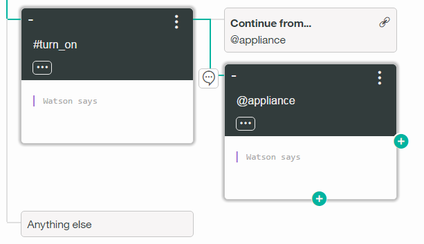
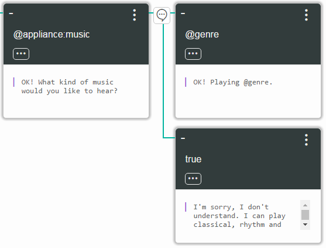

# Introduction

In this lab, you go through a step-by-step process to create an instance of the Conversation service and use the tools


# Objective

In the following lab, you will learn:

+ How to create a conversation dialog


# Pre-Requisites

+ Get a [Bluemix IBM id](https://bluemix.net)


# Steps

1. [Create a Watson Conversation service](#step-1---create-a-watson-conversation-service)
2. [Create your workspace](#step-2---create-your-worspace)
3. [Work with intents and examples](#step-3---work-with-intents-and-examples)
4. [Work with entities](#step-5---work-with-entities)
5. [Create a dialog](#step-5---create-a-dialog)


# Step 1 - Create a Watson Conversation service

1. On the Bluemix dashboard, select Catalog from the menu bar.

1. Scroll down to the Services section and click the icon for the Watson Conversation service. The Add Service page opens.

1. Click Create. The service instance is created, and the service dashboard page opens automatically.

1. On the dashboard page, click Launch Tool. The "Create workspace" page opens.


# Step 2 - Create your workspace

A workspace is a container for all the artifacts that define the behavior of your service.

1. On the "Create workspace" page, click Create.

1. In the **Name** field, type ```Car tutorial```.

1. Select **Create**. The new workspace is created and appears as a tile on your dashboard.


# Step 3 - Work with intents and examples

Use the Intents tab to define intents. These will later be used in your dialog flow.

Try adding new intents:

1. On the Workspaces page, click the **Car tutorial** workspace tile. The workspace page opens to the Intents tab.

1. On the Intents tab, click **Create**.

1. In the **Intent name** field, type ```turn_on```. This intent will be used to indicate that the user wants to turn on an appliance such as the radio, windshield wipers, or headlights.

1. Add example utterances that will help Watson recognize the #turn_on intent:

  1. In the **User example** field, type ```I need lights``` and press Enter. The example utterance ```I need lights``` is added to the intent.

  1. Repeat the same process to add the following examples:

      + Listen to some music
      + Play some tunes
      + Air on please
      + Turn on the headlights
      
1. Now that you have added at least 5 examples, click **Done**. The intent is created and appears on the Intents page.

1. Repeat the same process to create a #greeting intent. Specify the following example utterances:

  + Hello
  + Hi
  + Good morning
  + Good afternoon
  + Good evening

**Results**
You have now defined two intents (#turn_on and #greeting), along with example utterances that will train Watson to recognize these intents in user input.

# Step 4 - Work with entities

Each entity definition includes a set of specific entity values that can be used to trigger different responses. Each value can have multiple synonyms, which define different ways that the same value might be specified in user input. When the user's input is received, both intents and entities are identified, and you can use them in the corresponding dialog flow to choose the right response.

Create entities to represent what the user wants to turn on:

1. On the **Car tutorial** workspace page, click the Entities tab.

1. On the Entities tab, click **Create**.

1. In the **Entity** field, type ```appliance```. The @appliance entity represents an appliance in the car that a user might want to turn on.

1. Define a value for the @appliance entity:

  1. In the **Value** field, type ```music```. This value represents a specific appliance that users might want to turn on.

  1. In the **Synonyms** field, type ```radio```. This indicates that ```radio``` is another way of specifying the same value for the @appliance entity.
  
  1. Click the plus sign (+) to define additional values for @appliance:

    + ```headlights```, with the synonym ```lights```
    + ```air conditioning```, with the synonym ```air```
    
  1. Click Done. The @appliance entity is created now appears on the Entities tab.

1. On the Entities tab, click **Create** to create another entity.

1. Define a value for the @genre entity:

  1. In the **Entity** field, type ```classical```.

  1. In the **Synonyms** field, type ```symphonic```.
  
1. Click the plus sign (+) to define additional values for @genre:

  + ```rhythm and blues```, with the synonym ```r&b```
  + ```rock```, with the synonym ```pop```

1. Click **Done**. The @genre entity is created and now appears on the Entities tab.

**Results**
You have defined two entities: @appliance (representing an appliance the can turn on) and @genre (representing a genre of music the user can choose). You can now define a dialog that uses intents and entities to choose the correct response.

# Step 5 - Create a dialog

A dialog is a set of conversational nodes that are contained in a workspace. Together the set of nodes makes a dialog tree, on which every branch is a conversation that can be had with a user.

First we need to create a starting node for the dialog:

1. On the **Car tutorial** workspace page, click the Dialog tab.

1. Click **Create**. The dialog is created with a single root node:

  

1. Specify the condition and response for the starting node of the conversation:

  1. In the **Enter a condition** field, type ```conversation_start```. As you type, a drop-down list appears; select **conversation_start (create new condition)**. This indicates that this node is triggered automatically at the beginning of the conversation.

  1. In the **Watson says** field, type ```Welcome to the car demo!``` This is the response that Watson will issue when the specified condition (in this case, the conversation start) is true.
  
  1. Click the "Anything else" node that was created automatically when you defined the conversation_start node.

  1. In the **Watson says** field of the "Anything else" node, type ```I'm sorry, I don't understand. Please try again.``` This is the response that Watson will issue when the user input does not match any other node.
  
1. Test the conversation:

  1. Click the Try it out  icon. In the chat pane, you should see the response (```Welcome to the car demo```) displayed automatically.
  
  1. Type any input and press Enter. Because you have not yet defined any other nodes, you should see the response I'm sorry, I don't understand. Please try again.

  1. Close the chat pane.

Now we can create dialog branches that handle the defined intents.

1. Create a dialog branch to respond to the #greeting intent. This intent requires only a simple response, so the branch can consist of only a single node.

  1. Click the conversation_start node.

  1. Click the **+** icon on the bottom of the node to create a new root-level node. Because this new node is a peer of the conversation_start node (rather than a subnode), it represents an alternative conversation.

  1. In the **Enter a condition** field, type ```#greeting```. When the drop-down list appears, press Enter to select **#greeting**. This specifies that this node will be triggered by any input that matches the #greeting intent.

  1. In the **Watson says** field, specify ```Hi! What can I do for you?```.

   
  
1. Test the dialog:

  1. Click the  icon to open the chat pane.
  
  1. Type ```Hello``` and press Enter. The output shows that the #greeting intent is recognized, and the appropriate response appears.
  
  
  
1. Create another dialog branch to respond to the #turn_on intent. Because there are multiple possibilities for what the user might want to turn on, this branch requires multiple nodes to represent a more complex conversation. Start by creating the root-level node:

  1. Click the **+** icon on the bottom of the #greeting node to create a new root-level node.
  
  1. In the **Enter a condition** field, type ```#turn_on```. When the drop-down list appears, press Enter to select **#turn_on**. This specifies that this node will be triggered by any input that matches the #turn_on intent. Leave the **Watson says** field blank; the dialog needs more information before it can choose a response.
  
The #turn_on intent requires additional processing, because the dialog needs to determine what appliance the user wants to turn on. To handle this, we can extend the dialog branch with subnodes:

1. Add a subnode to verify that the user specified a valid appliance to turn on. If the dialog recognizes the #turn_on intent in the user input, the next step is to check the input to make sure the user specified one of the defined values for the @appliance entity. To do this, add a subnode:

  1. Click the **+** icon on the right side of the #turn_on node to create a new subnode.
  
  1. In the **Enter a condition** field, type ```@appliance```. When the drop-down list appears, press Enter to select **@appliance**. This specifies that this node will be triggered if the user input includes any recognized value for the @appliance entity. Leave the **Watson says** field blank; the dialog still needs more information before choosing a response.
  
  1. In the upper right corner of the #turn_on node, click the **Options** icon and then click **Continue from**.
  
  1. Click the @appliance node and then click **Go to condition**. The **Continue from** link indicates that if the #turn_on node evaluates as true, the dialog flow should pass to the @appliance node without waiting for additional user input. This is necessary because we want the @appliance node to continue evaluating the user's original input rather than waiting for new input.

  

1. Now add a peer subnode that will be triggered if the user input did not specify a valid appliance:

  1. Click the **+** icon on the bottom of the @appliance node to create a new peer subnode.
  
  1. In the **Enter a condition** field, type true. When the drop-down list appears, select **true (create new condition)**. This specifies that if the dialog execution flow reaches this node, it should always evaluate as true. (If the user specified a valid @appliance value, this node will never be reached.)
  
  1. In the **Watson says field**, type ```I'm sorry, I don't know how to do that. I can turn on music, headlights, or air conditioning.```

Now we need to add subnodes to determine the appropriate response when the user has specified a valid appliance:

1. Create a branch of subnodes that handle user requests to play music. Because the user must also specify a genre of music, this branch requires multiple levels of subnodes.

  1. Click the **+** icon on the right side of the @appliance node to create a new subnode. This subnode will be evaluated only if @appliance is true, meaning that the user has specified a valid appliance.

  1. In the **Enter a condition** field, type ```@appliance```. When the drop-down list appears, select **@appliance:music**. This specifies that this node will be triggered if the value of the @appliance entity is music or one of its synonyms, as defined on the Entities tab.
  
  1. In the *Watson says* field, type ```OK! What kind of music would you like to hear?```

  1. In the upper right corner of the @appliance node, click the **Options** icon and then click **Continue from**.
  
  1. Click the @appliance:music node and then click **Go to condition**. The **Continue from** link indicates that if the @appliance node evaluates as true, the dialog flow should pass to the @appliance:music node without waiting for additional user input.

  

  1. Click the **+** icon on the right side of the @appliance:music node to create a new subnode. This subnode will be evaluated only if @appliance is true, and only after the user has responded to the question about genre.

  1. In the **Enter a condition** field, type @genre. When the drop-down list appears, press Enter to select **@genre**. This specifies that this node will be triggered if the user input includes any recognized value for the @genre entity.
  
  1. In the **Watson says** field, type ```OK! Playing @genre```. At run time, the @genre variable will be replaced with the name of the genre specified by the user.
  
  1. Click the **+** icon on the bottom of the @genre node to create a new peer subnode.
  
  1. In the **Enter a condition** field, type true. When the drop-down list appears, select **true (create new condition)**. This specifies that if the dialog execution flow reaches this node, it should always evaluate as true. (If the user specified a valid @genre value, this node will never be reached.)
  
  1. In the **Watson says** field, type ```I'm sorry, I don't understand. I can play classical, rhythm and blues, or rock music.```
  
  

1. Test the dialog:

  1. Click the  icon to open the chat pane.
  
  1. Type ```Play music```. The bot recognizes the #turn_on intent and the @appliance:music entity, and it responds by asking you for a musical genre.
  
  1. Type the name or a synonym for a valid @genre value. The bot recognizes the @genre entity and responds appropriately.

  1. Type ```Play music``` again, but this time specify an invalid response for the genre. The bot responds by saying it does not understand.

1. Create a subnode to handle user requests to turn on other appliances. Because the other appliances do not require additional information, we can handle these requests with a single node.

  1. Click the **+** icon on the bottom of the @appliance:music node to create a new peer subnode.
  
  1. In the **Enter a condition** field, type true. When the drop-down list appears, select **true (create new condition)**. This specifies that if the dialog execution flow reaches this node, it should always evaluate as true. In this case, this node will only be reached if the user specified a valid appliance other than music.
  
  1. In the **Watson says** field, type ```OK, turning on the @appliance.```

1. Test the dialog:

  1. Click the   icon to open the chat pane.

  1. Type ```lights on```. The bot recognizes the #turn_on intent and the @appliance:headlights entity, and it responds with ```OK, turning on the headlights.```

  1. Type ```turn on the air.``` The bot recognizes the #turn_on intent and the @appliance:(air conditioning) entity, and it responds with ```OK, turning on the air conditioning.```

  1. Try variations on all of the supported commands based on the example utterances and entity synonyms you defined. If the bot fails to recognize the correct intent, you can retrain it directly from the chat window by clicking the incorrect intent and typing the correct intent in the field. (Do not include the # character when you type the intent name.)

  


# Resources

For additional resources pay close attention to the following:

- [Converstation Enhanced Sample Application](https://github.com/watson-developer-cloud/conversation-enhanced)

