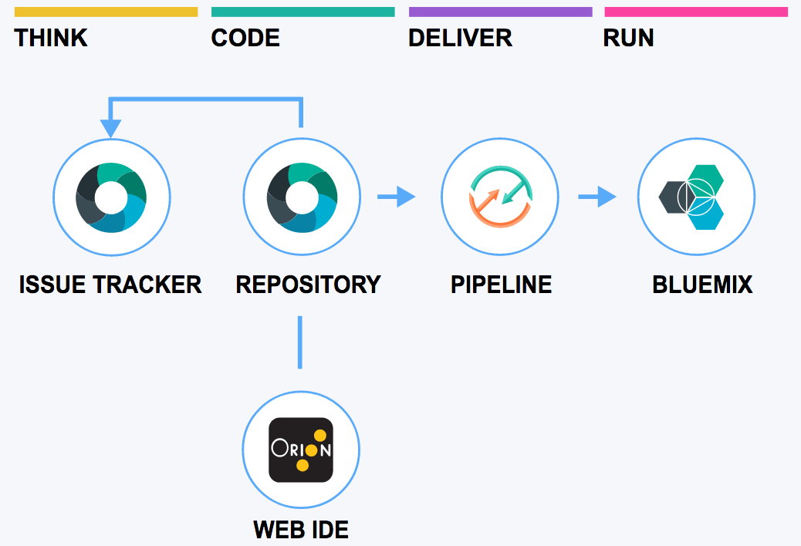

# Introduction

In this lab, you’ll gain a high level understanding of the architecture, features, and development concepts related to the Cloud Foundry runtimes and IBM Cloud service. Throughout the lab, you’ll create a sample application built with a CLEAN stack (CLoudant NoSQL database, Express, Angular and Node.js).


# Objective

In the following lab, you will learn:

+ How to deploy a new Cloud Foundry app based on Node.js runtime
+ How to create a new service Cloudant DB to store NoSQL data
+ How to set up a source code repository to collaborate
+ How to manage Continuous Integration and Deployment
+ How to use the Cloud Foundry Command Line


# Pre-Requisites

+ Create a [free account](https://bluemix.net), or use an existing account.
+ Install the [IBM Cloud CLI](https://console.bluemix.net/docs/cli/reference/bluemix_cli/download_cli.html)
+ Install a [Git client](https://git-scm.com/downloads)
+ Install [Node.js](https://nodejs.org)


# Steps

1. [Create a new web application](#step-1---create-a-new-web-application)
1. [Enable Continuous Delivery](#step-2---enable-continuous-delivery)
1. [Checkout the code locally](#step-3---checkout-the-code-locally)
1. [Run the app locally](#step-4---run-the-app-locally)
1. [Change a file locally](#step-5---change-a-file-locally)
1. [Push your local change to the cloud](#step-6---push-your-local-change-to-the-cloud)
1. [Commit your changes and see them deployed automatically](#step-7---commit-your-changes-and-see-them-deployed-automatically)
1. [Get the Todo App code](#step-8---get-the-todo-app-code)
1. [Create and bind a Cloudant service](#step-9---create-and-bind-a-cloudant-service)
1. [Connect the Cloudant DB to the application code](#step-10---connect-the-cloudant-db-to-the-application-code)
1. [Run the Todo App locally](#step-11---run-the-todo-app-locally)
1. [Commit the changes](#step-12---commit-the-changes)
1. [Leverage the API](#step-13---leverage-the-api)


# Step 1 - Create a new web application

1. Log in to [IBM Cloud Console](https://console.bluemix.net).

1. Select the **Region** where you want to deploy your application.

1. Go to the IBM Cloud **Catalog**.

1. In the **Compute** category, scroll down to **Cloud Foundry**

1. Create a new app with the ***SDK for Node.js***.

1. Give your app a unique name and unique host (e.g. todo-[your-initials])

1. View your application.

The SDK for Node.js created a simple "Hello World!" web app that will become our starting point.


# Step 2 - Enable Continuous Delivery

Now let's add a source code repository and an automatic build pipeline to our project. The Git repository and issue tracking is hosted by IBM and built on GitLab Community Edition.

1. In your application **Overview** page, search **Continuous Delivery** and click the **Enable** button.

1. A new window opens to configure the Toolchain.

    

1. The toolchain gets a default name you can change. In **Tool Integrations** at the bottom, select **Git Repos and Issue Tracking**.

1. Keep the Default options to **Clone** the starter code for the "Hello World!" application into your GitLab account.

1. The toolchain has been configured successfully. A new Git Repository has been created, as well as a Build Pipeline so that your app gets automatically redeployed after every commit.

1. Open the Git repo and make note of the Git URL.


# Step 3 - Checkout the code locally

1. Open a terminal or a command prompt to clone the repository

    ```
    git clone <URL-OF-YOUR-GIT-REPO>
    ```

1. This command creates a directory of your project locally on your disk.


# Step 4 - Run the app locally

1. Change to the directory of the checkout

    ```
    cd todo-[your-initials]
    ```

1. Get the node.js dependencies for this project

    ```
    npm install
    ```

1. Start the app

    ```
    npm start
    ```

    Once started, the console output will look as follows:

    ```
    > NodejsStarterApp@0.0.1 start /Users/mace/todo-[your-initials]
    > node app.js

    server starting on http://localhost:[port-number]
    ```

1. Access the app with your web browser


# Step 5 - Change a file locally

1. Open **public/index.html**, modify the welcome message at line 19

1. Reload the page in your web browser to confirm the change locally


# Step 6 - Push your local change to the cloud

Cloud Foundry relies on the *manifest.yml* file to know what to do when you push the app on IBM Cloud.
A default manifest.yml file was generated for our app. It looks like:

  ```yml
  applications:
  - path: .
    name: todo-[your-initials]
    environment_json: {}
    memory: 256M
    instances: 1
    disk_quota: 1024M
    services: []
  ```

It basically defines one application taking its content from the current directory,
being deployed with **256MB**, with **one** instance.
The app is named **todo-[your-initials]**.
It has **1024MB** of disk space available.

1. Specifying the buildpack to be used when pushing a Cloud Foundry app is always faster than relying on buildpack detection. Modify the generated Manifest to specify the **buildpack** by adding one line as follows:

    ```yml
    applications:
    - path: .
      name: todo-[your-initials]
      environment_json: {}
      memory: 256M
      instances: 1
      buildpack: sdk-for-nodejs
      disk_quota: 1024M
      services: []
    ```

1. Login to IBM Cloud.

    ```
    ibmcloud login
    ```

1. Select the region where you deployed your application.

    ```
    ibmcloud login
    ```

1. Push the app to IBM Cloud

    ```
    ibmcloud cf push
    ```

1. When the command completes, access the application running in the cloud to confirm your change was deployed

    ```
    requested state: started
    instances: 1/1
    usage: 256M x 1 instances
    urls: todo-[your-initials].mybluemix.net
    last uploaded: Mon Jan 16 21:20:54 UTC 2017
    stack: cflinuxfs2
    buildpack: SDK for Node.js(TM) (ibm-node.js-4.6.2, buildpack-v3.9-20161128-1327)

         state     since                    cpu    memory          disk          details
    #0   running   2017-01-16 10:22:17 PM   4.6%   22.1M of 256M   65.8M of 1G    
    ```

Changing files locally and pushing them worked but we can do better.
In a previous step we set up a Git repository and a build pipeline was automatically configured.


# Step 7 - Commit your changes and see them deployed automatically

1. Open **public/index.html**.

1. Change the page title at line 5.

1. Confirm the change works locally.

1. Commit your changes locally
    ```
    git commit -a -m "updated title"
    ```

    Note: you might be prompted to configure git for the first time:
    ```
    git config --global user.email "you@example.com"
    git config --global user.name "Your Name"
    ```

1. Push your changes
    ```
    git push
    ```

1. Back to the IBM Cloud console, go to your application **Overview**.

1. Click on the **View Toolchain** button in the Continuous Delivery section.

1. Click the **Delivery Pipeline** that was created automatically in a previous step.

1. Watch how the Delivery pipeline notice your commit and redeploy the application

1. When the command completes, access the application running in the cloud to confirm your change was deployed


# Step 8 - Get the Todo App code

In previous steps, we've seen the basic of modifying code and deploying the application.
Now let's focus on our task to build a Todo App. The application has already been developed and is available in this Git repository.

Your first task is to integrate this code in the app you created, replacing the existing app code.

1. Delete all files and folders from your app **except the manifest.yml and .git folder**.

1. Download the complete Todo application from [this archive](./solution/node-todo-master.zip) into a temp directory.

1. Unzip the files in a temp directory. It creates a *node-todo-master* folder.

1. Copy all files and directories from the extract to your app folder.

Note: Make sure the hidden files (.gitignore, .cfignore and .bowerrc) were also copied.


# Step 9 - Create and bind a Cloudant service

In order to store the todo, we will need a persistent storage. To do so, we will use a Cloudant NoSQL database, a JSON document oriented store, compatible with CouchDB.

1. Back to the IBM Cloud console, go to your application **Overview**.

1. Click **Connect New** to add a service to your application

1. Search for **Cloudant** in the catalog

1. Select the free **Lite** plan

1. Give the service a name such as **todo-cloudant-[your-initials]**

1. Click **Create**. IBM Cloud will provision a Cloudant service and connect it to your application.

1. Select **Restage** when prompted to do so.

    Your application will restart and the service connection information will be made available to your application.

    Note: All the steps above could have been scripted using the three commands below:
    ```
    cf create-service cloudantNoSQLDB Lite todo-cloudant-[your-initials]
    cf bind-service todo-[your-initials] todo-cloudant-[your-initials]
    cf restage todo-[your-initials]
    ```

# Step 10 - Connect the Cloudant DB to the application code

When your application runs in Cloud Foundry, all service information bound to the application are available in the **VCAP_SERVICES** variable.

Given a Cloud Foundry app relies on the VCAP_SERVICES environment variable, a straightforward approach is to set this variable in your environment by creating a local env file (JSON or key=value format), to test for this file in your app and to load the values if found.

1. In the IBM Cloud console, go to your application dashboard.

1. Select **Runtime**, then **Environment Variables**

1. Copy the full content of the **VCAP_SERVICES** into the file vcap-local.json of your project. Make sure to copy the content on line 3 below the services element. It should look as follows:

    ```json
    {
      "services":
      {
        "cloudantNoSQLDB": [
          {
            "credentials": {
                "username": "XXXX",
                "password": "XXXX",
                "host": "XXXXXX-bluemix.cloudant.com",
                "port": 443,
                "url": "https://....-bluemix.cloudant.com"
            },
            "name": "todo-cloudant",
            "label": "cloudantNoSQLDB",
            "plan": "Lite",
            ...
          }
        ]
      }
    }
    ```


# Step 11 - Run the Todo App locally

1. Get the dependencies for the Todo App. In your app directory, run:

    ```
    npm install
    ```

1. Run the application

    ```
    npm start
    ```

1. Access the local application


# Step 12 - Commit the changes

1. Add all new files to Git:

    ```
    git add .
    ```

1. Commit:

    ```
    git commit -a -m "full solution"
    ```

1. Push to remote Git

    ```
    git push
    ```

1. Watch the Delivery Pipeline processing your commit and deploying a new version of your app.

Congratulations! You completed this lab. You can get familiar with the application code content.

# Step 13 - Leverage the API

The TODO app contains API endpoints for PUT/GET/DELETE (create/retrieve/delete).

1. To list the existing todos, you can simply open in a browser the page [https://[your-initials].mybluemix.net/api/todos](https://todo-[your-initials].mybluemix.net/api/todos)

1. To create a new todo using a tool such as curl, run the following command after updating the url with your initials
    ```
    curl -X PUT https://todo-[your-initials].mybluemix.net/api/todos -d text=newtodo
    ```

## Source code

### Back-end

| File | Description |
| ---- | ----------- |
|**package.json**|Lists the node.js dependencies|
|**.cfignore**|List of files and directories ignored when calling **cf push**. Typically we ignore everything that can be retrieved with bower or npm. This speeds up the push process.|
|**manifest.yml**|Used by Cloud Foundry when pushing the application to define the application environment, connected services, number of instances, etc.|
|**app.js**|Web app backend entry point. It initializes the environment and imports the Todo API endpoints|
|**todos.js**|Todo API implementation. It declares endpoints for PUT/GET/DELETE (create/retrieve/delete) and handles the *in-memory* storage.

### Front-end

| File | Description |
| ---- | ----------- |
|**.bowerrc**|Configuration file for the [bower](http://bower.io/) web package manager to put our web dependencies under public/vendor|
|**bower.json**|Web dependencies (bootstrap, angular)|
|**index.html**|Web front-end implementation. It displays the todo list and has a form to submit new todos.|
|**todo.js**|Declares the Angular app|
|**todo.service.js**|Implements the connection between the front-end and the back-end. It has methods to create/retrieve/delete Todos|
|**todo.controller.js**|Controls the main view, loading the current todos and adding/removing todos by delegating to the Todo service|


# Resources

For additional resources pay close attention to the following:

- [GitHub Guides](https://guides.github.com/)
- [Get started guides for your favorite runtimes](https://www.ibm.com/blogs/bluemix/2017/03/runtimes-get-started-guides/?social_post=829410659&fst=Learn&linkId=35308736)
