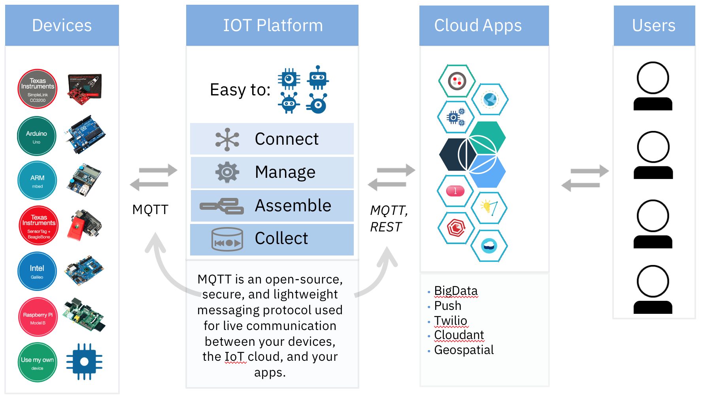
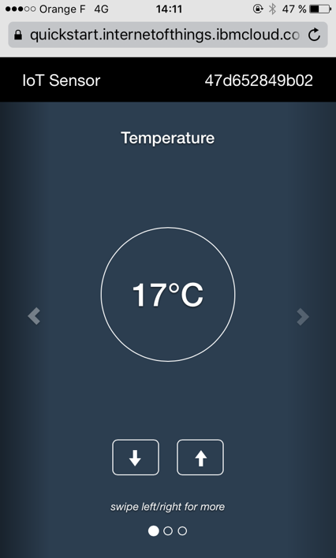
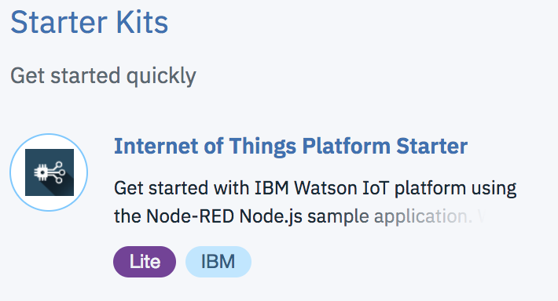
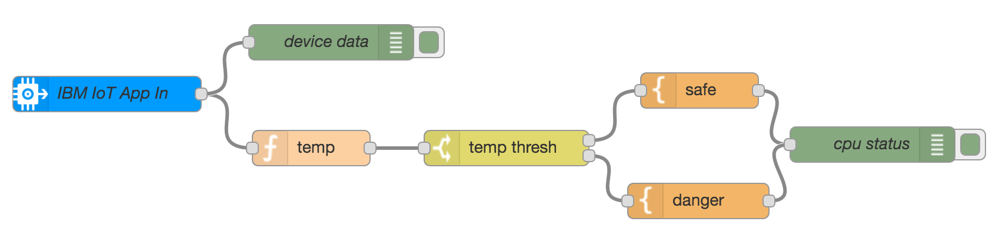
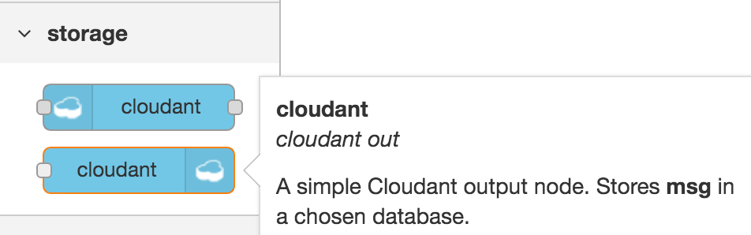
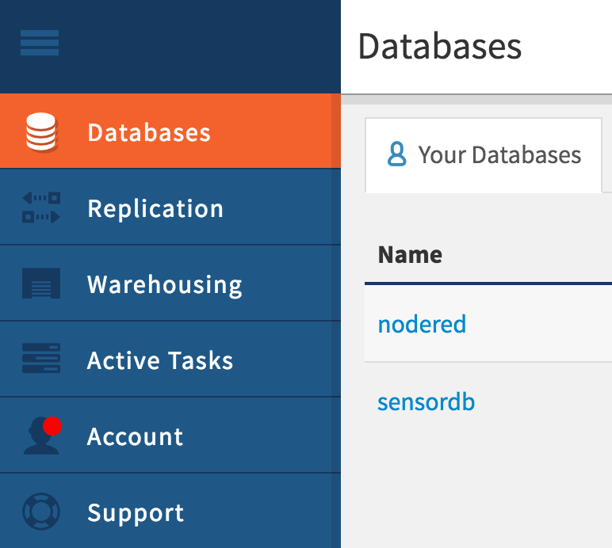
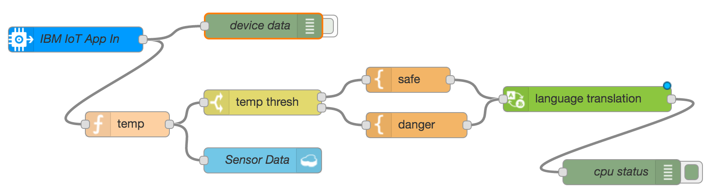

# Introduction

This tutorial demonstrates how to connect a simulated device to the Watson IoT platform, vizualise its live data, store its data into a database and leverage [Node-RED](http://www.nodered.org) tool for wiring together hardware devices, APIs and online services.

  


# Objectives
* You will collect sensor data from a Watson IOT service.
* You will simulate a temperature sensor.
* You will discover how to leverage Node-RED to connect IoT.
* You will store the collected data into a NoSQL database.
* You will use Watson to translate messages.


# Pre-Requisites
* An [IBM Cloud](http://www.bluemix.net) account


# Start the simulated device

We will use a simulator of a temperature sensor. This sensor also simulates Humidity and Object Temperature.<br />
This way, we don't require an actual hardware device to test our application.

1. In a new browser window or on a smartphone, browse to [IOT Sensor](http://quickstart.internetofthings.ibmcloud.com/iotsensor).
<br />Alternatively, enter this short URL: http://ibm.biz/iotsensor

    

1. Note the Device Id (displayed in the top right corner).


# View the live sensor data

1. In a new browser window, browse to [Watson IOT Platform quickstart](https://quickstart.internetofthings.ibmcloud.com).
<br />Alternatively, enter this short URL: http://ibm.biz/iotquickstart

    

1. Enter the device id.

1. Vizualise the live sensor data.


# Connect your device to the Watson IOT Platform

You've seen my data, what next? Now you will use your device in an application created with IBM Cloud.

1. Create an app using **Internet of Things Platform Starter** from the category **Starter Kits** in the Catalog.

    

1. Provide the application name, modify the host name, if required, and click **Create**.
<br /> *Note: Wait for a few minutes for your app to start running.*

1. When your app is running, select the app URL or type it into the browser to open the **Node-RED flow editor**

    ```
    https://<appname>.mybluemix.net
    ```

1. You see a ready-made flow that can process temperature readings from a simulated device.

    

# Use Node-RED to read the sensor data

1. In the Node-RED workspace, double-click the **IBM IoT App In** node to open the configuration dialog.

    

1. In the Authentication type field, select **Quickstart** from the pull-down list. Enter the Device ID field and click OK.
<br />*Make sure that the device id is entered in lowercase, and that there are no leading or trailing space characters.*

1. Look for the **Deploy** button in the upper right hand corner of your Node-RED workspace. The deploy button is now red; click it to deploy your flow.

    

1. Open the debug pane on the right. You will see that the flow is generating Temperature Status messages.

1. Increase the temperature value on the simulator to see the messages change in the debug pane.
<br /> *Note that a different message appears if the temperature exceeds 40 degrees.*

# Store the device data into a No SQL database

1. In Node-RED flow editor, add a **Cloudant out** node

    

1. In the Service type field, select the name of Cloudant service bound to Node.js runtime from the pull-down list.
<br />Enter a dabatase name in lowercase. Keep the default operation insert and finally give a name to the node.

  

1. Deploy the flow. Return to the IBM Cloud Console, go to the Cloudant console and navigate into the records.

  

# Translate messages with Watson.

The warning messages generated in Node-RED uses English by default. You may want to translate those messages into your oww language.

1. In IBM Cloud Console, create a new service **Language Translator** to your app.

1. From the Dashboard, open your app using **Internet of Things Platform Starter** and connect this new service Language Translator to your app.

1. In Node-RED flow editor, insert a new **Language Translator** node into the existing flow.

1. Modify the flow accordingly to translate those messages.

    

1. Deploy the updated flow.

1. Observe the translated output based on the selected language.


# Resources

For additional resources pay close attention to the following:

- [Real Time Data Analysis Using IoT Platform Analytics](https://developer.ibm.com/recipes/tutorials/real-time-data-analysis-using-ibm-watson-iot-platform-analytics)