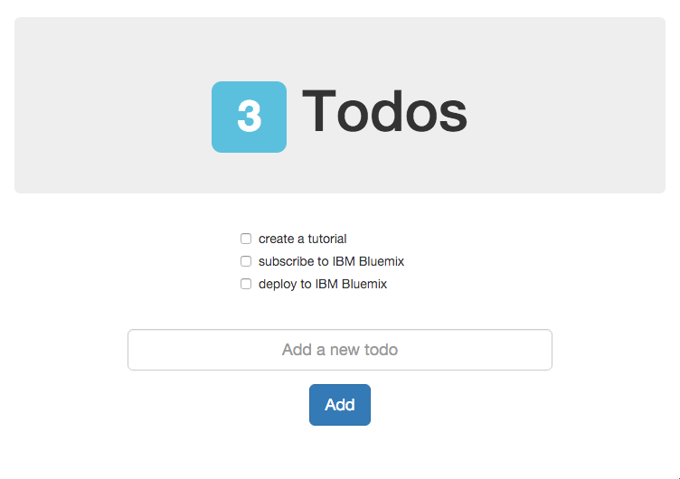

# Todo App Tutorial

This is a sample application built with a CLEAN stack (CLoudant NoSQL database, Express, Angular and Node.js).

**If you are looking for the step-by-step tutorial, look at [this branch](https://github.com/lionelmace/node-todo/tree/tutorial).**



[](https://bluemix.net/deploy)

## Running the app on Bluemix

1. Create a Bluemix Account

    [Sign up][bluemix_signup_url] for Bluemix, or use an existing account.
    
1. Download and install the [Cloud-foundry CLI][cloud_foundry_url] tool

1. Clone the app to your local environment from your terminal using the following command

  ```
  git clone https://github.com/lionelmace/node-todo
  ```

1. cd into this newly created directory

1. Connect to Bluemix in the command line tool and follow the prompts to log in.

	```
	$ cf login
	```
    
1. Create the Cloudant service in Bluemix.

  ```
  $ cf create-service cloudantNoSQLDB Shared todo-cloudant
  ```

1. Push the application to Bluemix.

  ```
  $ cf push
  ```

And voila! You now have your very own instance of the Todo application running on Bluemix.
Navigate to the application url, e.g. `<application-host>.mybluemix.net` to create Todo.

## Running the app locallly

You can run the application locally, connecting to the Cloudant service running in IBM Bluemix.
To do so you need we will create one file to store the Cloudant credentials.
These credentials can be retrieved in the IBM Bluemix dashboard.

To run the application locally, you will need:
  * [NodeJS](http://nodejs.org)


1. Copy **template.vcap-local.json** to **vcap-local.json**

1. Edit **vcap-local.json** and fill in the *url* of the Cloudant database

1. In the project directory, run:

  ```
  $ npm install
  ```

  This will get all the server-side and client-side (through *bower*) dependencies for the project.

1. Start the application

  ```
  $ npm start
  ```

  The console output will look like:
  ```
  Loaded local VCAP { services: { cloudantNoSQLDB: [ [Object] ] } }
  Initializing database...
  Creating database...
  server starting on http://localhost:6020
  Setting current database to todos
  ```

## License

See [License.txt](License.txt) for license information.

## Credits

Based on [scotch-io/node-todo](https://github.com/scotch-io/node-todo)

---

This is a sample application created for the purpose of demonstration and learning
The program is provided as-is with no warranties of any kind, express or implied.

[bluemix_signup_url]: https://console.ng.bluemix.net/?cm_mmc=GitHubReadMe-_-BluemixSampleApp-_-Node-_-Workflow
[cloud_foundry_url]: https://github.com/cloudfoundry/cli/releases